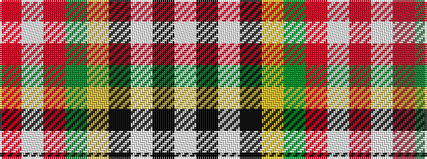

RWRGYKWKW

It is a 9 stripe tartan.

<figure class="pat-woven">

<figcaption>idealised sample</figcaption>
</figure>

## Colour Sequence



## Tartans with this colour sequence

| Tartans |
|---------------|
| [Cumming LO](/variants/s9/r4lb1r4dg10ly1k10lb4k2lb4/)|
||
