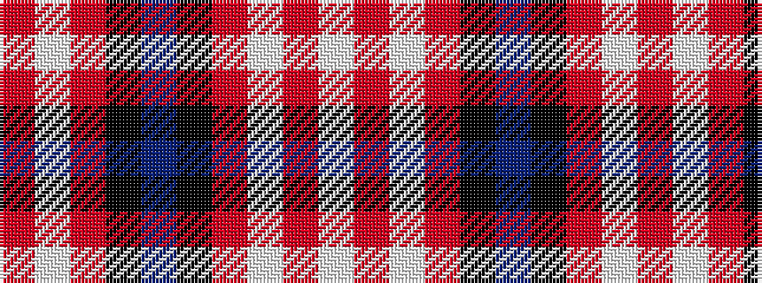

RWRKBKRWRW

It is a 10 stripe tartan.

<figure class="pat-woven">

<figcaption>idealised sample</figcaption>
</figure>

## Colour Sequence



## Tartans with this colour sequence

| Tartans |
|---------------|
| [MacGregor Dress Red Fancy Tartan Tartan Number: 6541. Earliest known date: 1975 A Dancers tartan now woven by D C Dalgliesh of Selkirk. See products available Copyright © Blair Urquhart, Comrie, 2015](/setts/s10/w52r22w6r8k1db3~x2/)|
||
