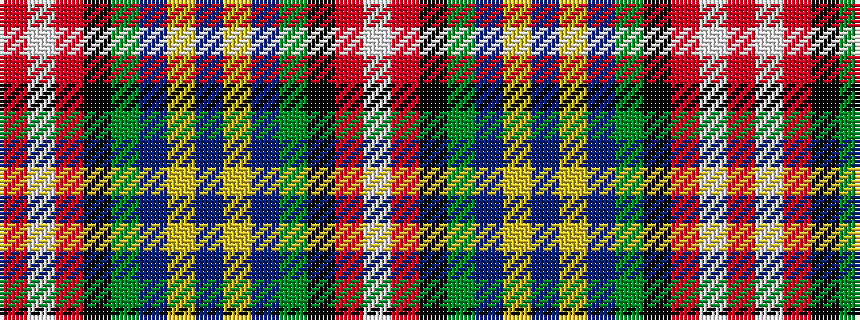

RWRKGBYBYBGKRW

It is a 14 stripe tartan.

<figure class="pat-woven">

<figcaption>idealised sample</figcaption>
</figure>

## Colour Sequence



## Tartans with this colour sequence

| Tartans |
|---------------|
| [Unidentified Lindley #4](/setts/s14/w3o30k4g2db17ly3db2ly3db17g2k4o30w3o2~x2/)|
||
