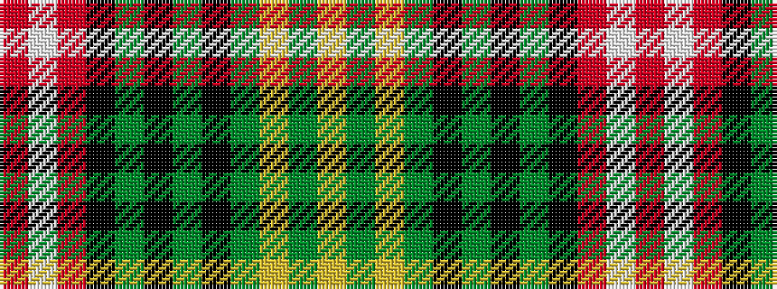

RWRKGKGKGYGY

It is a 12 stripe tartan.

<figure class="pat-woven">

<figcaption>idealised sample</figcaption>
</figure>

## Colour Sequence



## Tartans with this colour sequence

| Tartans |
|---------------|
| [Wcwm 1712](/variants/s12/r8w2r22k8dg6k6dg6k6dg8lg3dg3lg3~x2/)|
||
