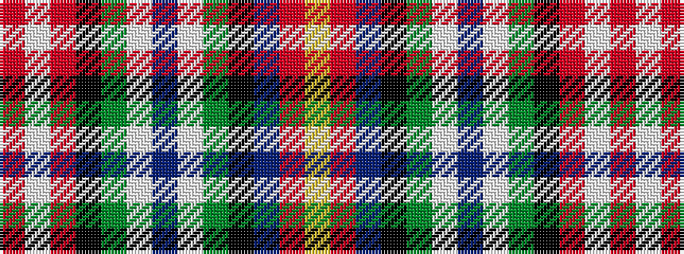

RWRKGWBWGKBRY

It is a 13 stripe tartan.

<figure class="pat-woven">

<figcaption>idealised sample</figcaption>
</figure>

## Colour Sequence



## Tartans with this colour sequence

| Tartans |
|---------------|
| [Colorado Rogues (Corporate)](/setts/s13/r6w6r16k16g22w2dp2w2g22k16db13r2ly4/)|
||
