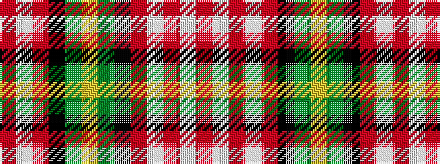

RWRKGYGKRWRWR

It is a 13 stripe tartan.

<figure class="pat-woven">

<figcaption>idealised sample</figcaption>
</figure>

## Colour Sequence



## Tartans with this colour sequence

| Tartans |
|---------------|
| [Beartrap (Military)](/variants/s13/r22lb1r2lb1r3k16g16ly1g16k16r16lb1r2~x2/)|
||
