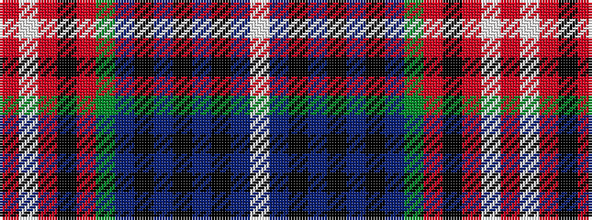

RWRKRGBKBKBKBW

It is a 14 stripe tartan.

<figure class="pat-woven">

<figcaption>idealised sample</figcaption>
</figure>

## Colour Sequence



## Tartans with this colour sequence

| Tartans |
|---------------|
| [Taiwan Scottish](/setts/s14/r13w2r13k3ri13dg21n3k18n9k2n2k2n15w2~x2/)|
||
| [Tawain Scottish (Commemorative)](/setts/s14/r13w2r13k3ri13g21db3k18db9k2db2k2db15w2~x2/)|
||
