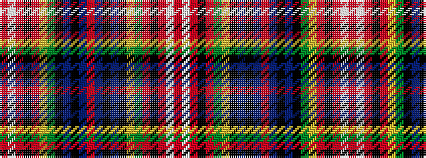

RWRKRGYKBKBRBKBKGYRKRWR

It is a 23 stripe tartan.

<figure class="pat-woven">

<figcaption>idealised sample</figcaption>
</figure>

## Colour Sequence



## Tartans with this colour sequence

| Tartans |
|---------------|
| [Cromdale](/variants/s23/r20w1r20k2r20g8ly1k4db1k1db4r1db4k1db1k4g8ly1r20k2r20w1r20~x2/)|
||
