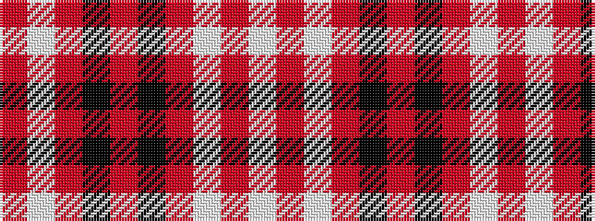

RWRKRKRWRW

It is a 10 stripe tartan.

<figure class="pat-woven">

<figcaption>idealised sample</figcaption>
</figure>

## Colour Sequence



## Tartans with this colour sequence

| Tartans |
|---------------|
| [MacGregor Dress Burgundy Fancy Tartan](/variants/s10/w52ri22w6ri8k1r3~x2/)|
||
