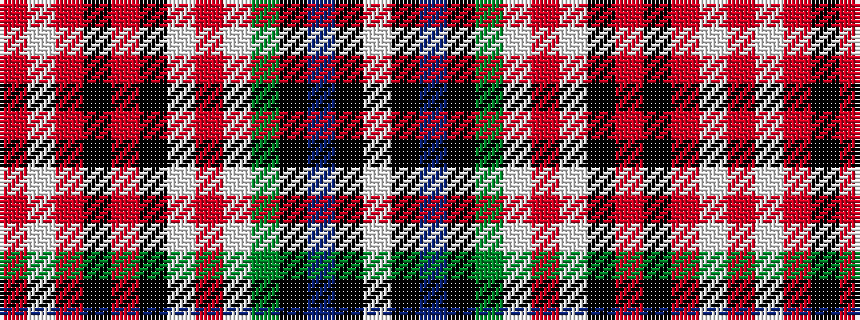

RWRKRKWRWGKBKW

It is a 14 stripe tartan.

<figure class="pat-woven">

<figcaption>idealised sample</figcaption>
</figure>

## Colour Sequence



## Tartans with this colour sequence

| Tartans |
|---------------|
| [Kenya](/setts/s14/w4k1db12k1dg8w2r8w2k8r16k4r8w2r1~x2/)|
||
