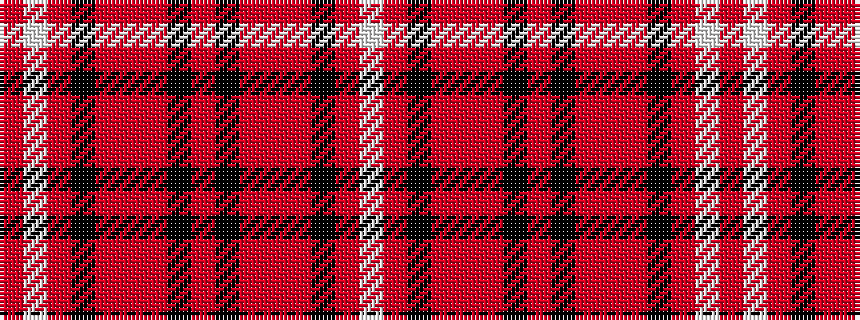

RWRKRRRKRKRRRKRW

It is a 16 stripe tartan.

<figure class="pat-woven">

<figcaption>idealised sample</figcaption>
</figure>

## Colour Sequence



## Tartans with this colour sequence

| Tartans |
|---------------|
| [Hampden-Sydney College](/variants/s16/r80w2r5k10r6o4r4k2o6k2r10o4r8k10r5w2/)|
||
