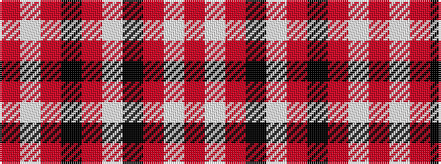

RWRKRWKRWR

It is a 10 stripe tartan.

<figure class="pat-woven">

<figcaption>idealised sample</figcaption>
</figure>

## Colour Sequence



## Tartans with this colour sequence

| Tartans |
|---------------|
| [South Carolina, University of](/setts/s10/r4w4r3k8w3r3k20r40w2r4/)|
||
