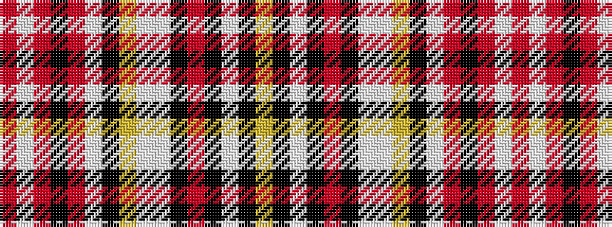

RWRKRWKYWWKRKWKY

It is a 16 stripe tartan.

<figure class="pat-woven">

<figcaption>idealised sample</figcaption>
</figure>

## Colour Sequence



## Tartans with this colour sequence

| Tartans |
|---------------|
| [Puccini's Madama Butterfly](/setts/s16/r6w1r1k15r1w2k1ly5w25w5k1m5k1w5k1ly5~x2/)|
||
