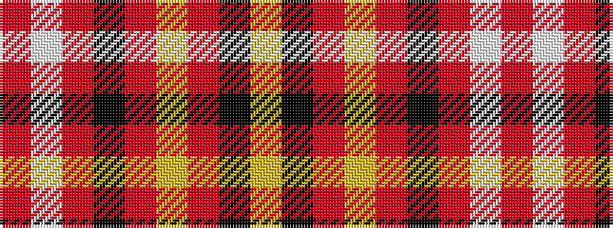

RWRKRYRKY

It is a 9 stripe tartan.

<figure class="pat-woven">

<figcaption>idealised sample</figcaption>
</figure>

## Colour Sequence



## Tartans with this colour sequence

| Tartans |
|---------------|
| [Hampden-Sydney College](/variants/s9/r80w2r5k10r6lr4r10k2lr6/)|
||
