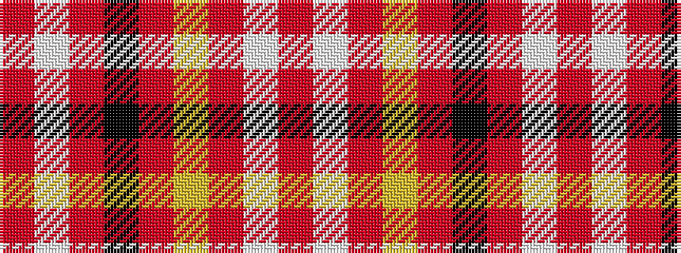

RWRKRYRWR

It is a 9 stripe tartan.

<figure class="pat-woven">

<figcaption>idealised sample</figcaption>
</figure>

## Colour Sequence



## Tartans with this colour sequence

| Tartans |
|---------------|
| [Middleton, City of](/setts/s9/o16w1o1k1o8lo4r2w2r2~x4/)|
||
