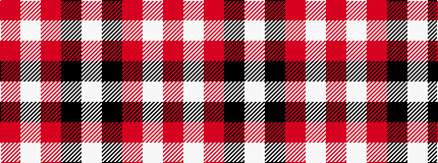

RWRKW

It is a 5 stripe tartan.

<figure class="pat-woven">

<figcaption>idealised sample</figcaption>
</figure>

## Colour Sequence



## Tartans with this colour sequence

| Tartans |
|---------------|
| [Glen App](/variants/s5/m13w3m1k3w1~x6/)|
||
| [Loch Morar](/variants/s5/r38w9r3k9w3~x2/)|
||
