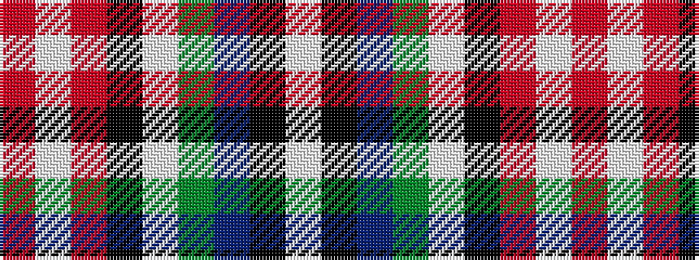

RWRKWGBKW

It is a 9 stripe tartan.

<figure class="pat-woven">

<figcaption>idealised sample</figcaption>
</figure>

## Colour Sequence



## Tartans with this colour sequence

| Tartans |
|---------------|
| [Unnamed C18th - Blanket Pattern](/variants/s9/w120k2db4g3w2k2r8w2r3~x2/)|
||
