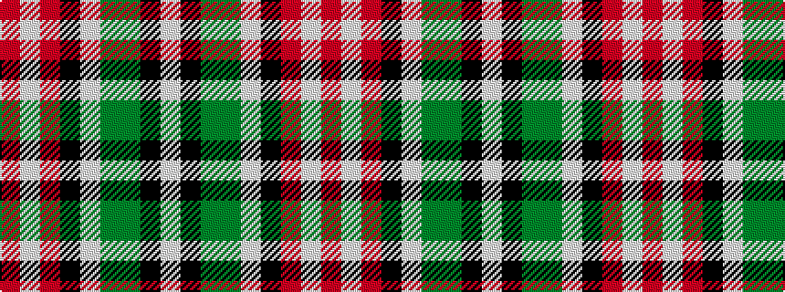

RWRKWGGKW

It is a 9 stripe tartan.

<figure class="pat-woven">

<figcaption>idealised sample</figcaption>
</figure>

## Colour Sequence



## Tartans with this colour sequence

| Tartans |
|---------------|
| [Drummond of Perth Dress (Dance)](/variants/s9/w50k3gi10g11w1k1r20w3r5~x2/)|
||
| [Unidentified Arisaid](/variants/s9/w216k8dg24g24w4k4r45w8r12/)|
||
