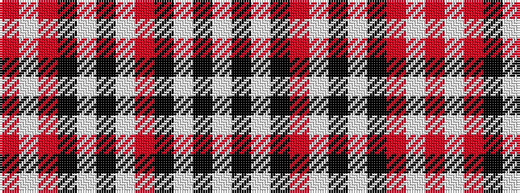

RWRKWKWRKWKW

It is a 12 stripe tartan.

<figure class="pat-woven">

<figcaption>idealised sample</figcaption>
</figure>

## Colour Sequence



## Tartans with this colour sequence

| Tartans |
|---------------|
| [Westgaard of Kileughtero](/variants/s12/r15w7r10ki7w3k3w3r10ki5w3k3w3~x2/)|
||
