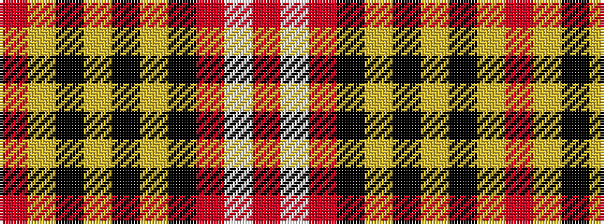

RWRKYKYKYR

It is a 10 stripe tartan.

<figure class="pat-woven">

<figcaption>idealised sample</figcaption>
</figure>

## Colour Sequence



## Tartans with this colour sequence

| Tartans |
|---------------|
| [Motherwell F.C. Fir Park Dress (Spor](/setts/s10/r3ly6k2ly2k2ly2k3r20lb1r3~x4/)|
||
