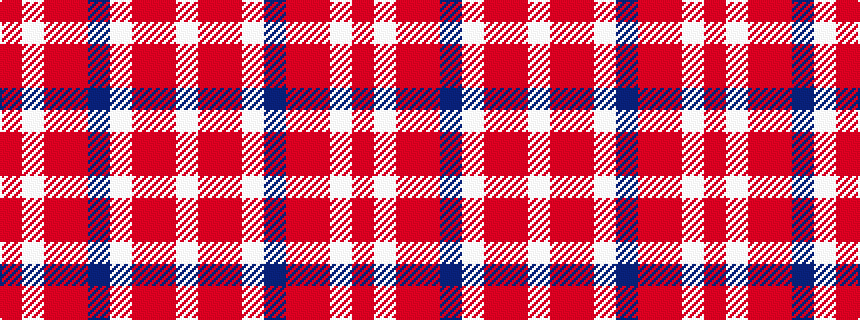

RWRRBWRRW

It is a 9 stripe tartan.

<figure class="pat-woven">

<figcaption>idealised sample</figcaption>
</figure>

## Colour Sequence



## Tartans with this colour sequence

| Tartans |
|---------------|
| [Unidentified #41](/variants/s9/w6o1r4w1db4o1r8w1r2~x2/)|
||
