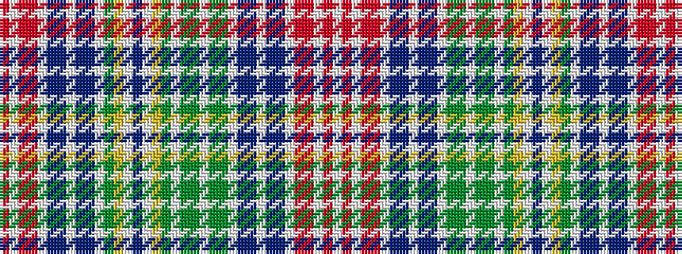

RWRRWBBWBBWGYWBWYGWGGWGGWBBWBBWRRWRW

It is a 36 stripe tartan.

<figure class="pat-woven">

<figcaption>idealised sample</figcaption>
</figure>

## Colour Sequence



## Tartans with this colour sequence

| Tartans |
|---------------|
| [Waggrall](/variants/s36/r4w1ri11r2w2p11t4w2t4p11w2gi4ly4w1p5w1ly4gi4w2g10gi4w2gi4g10w2t2p6w1p6t2w2r2ri11w1r4w1~x2/)|
||
| [Waggrall Family Tartan](/variants/s36/ri4w1r11ri2w2dp11t4w2t4dp11w2g4ly4w1dp5w1ly4g4w2gi10g4w2g4gi10w2t2dp6w1dp6t2w2ri2r11w1ri4w1~x2/)|
||
