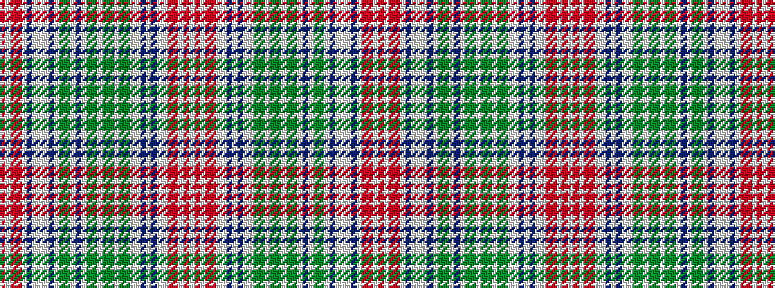

RWRRWBWWWBWGGWBWGGWGGWGGWWBWBWWRRWRW

It is a 36 stripe tartan.

<figure class="pat-woven">

<figcaption>idealised sample</figcaption>
</figure>

## Colour Sequence



## Tartans with this colour sequence

This pattern is a design lineage: every tartan below shares one colour order, whatever its owner —
near-identical designs are grouped, the largest lineage first (#112: the pattern is a tartan's
second parent, beside its family or clan).

<table class="sett-table">
<tbody>
<tr><td><a href="/variants/s36/ri4w1r11ri2w2dp11lb4w2lb4dp11w2g4y4w1dp5w1y4g4w2dg10g4w2g4dg10w2lb2dp6w1dp6lb2w2ri2r11w1ri4w1~x2~ri2406019-r2109032-g2408144-dg1806142/">Waggrall Family Tartan</a></td></tr>
<tr><td class="sett-swatch"></td></tr>
</tbody>
</table>

