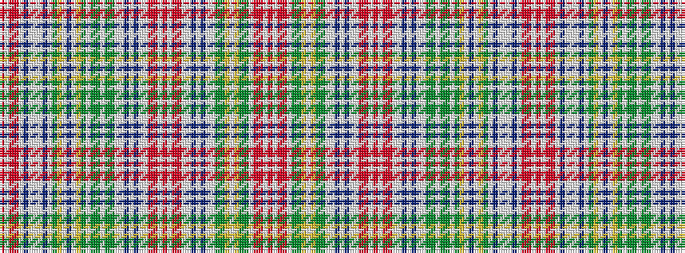

RWRRWBWWWBWGYWBWYGWGGWGGWWBWBWWRRWRWRRWWBWBWWGGYWYGGWRRWR

It is a 57 stripe tartan.

<figure class="pat-woven">

<figcaption>idealised sample</figcaption>
</figure>

## Colour Sequence



## Tartans with this colour sequence

| Tartans |
|---------------|
| [Waggrall (Clan)](/variants/s57/ri4w1r11ri2w2dp11lb4w2lb4dp11w2y4ly4w1dp5w1ly4y4w2dg10y4w2y4dg10w2lb2dp6w1dp6lb2w2ri2r11w1ri4w1r11ri2w2lb2dp6w1dp6lb2w2dg6y2ly2w1ly2y2dg6w2ri2r11w1ri4~x2/)|
||
