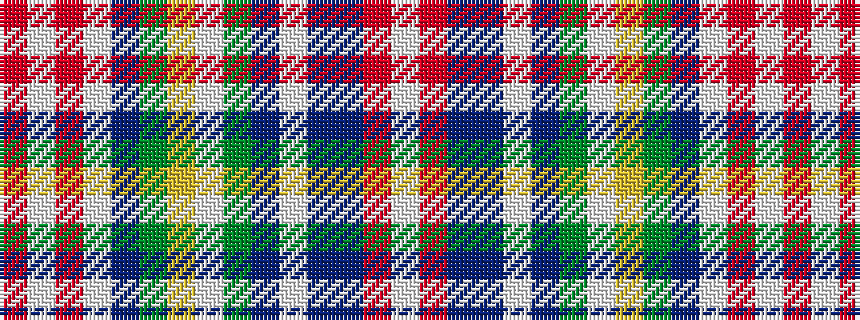

RWRWBGYWGBWBBRW

It is a 15 stripe tartan.

<figure class="pat-woven">

<figcaption>idealised sample</figcaption>
</figure>

## Colour Sequence



## Tartans with this colour sequence

| Tartans |
|---------------|
| [Stuart / Stewart, Plaid](/variants/s15/r16w4o100w4db34g30ly10w3g16dp12w4db16dr64r26w4/)|
||
