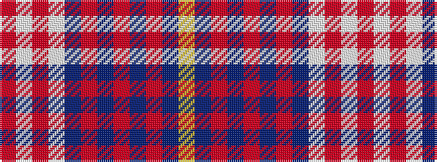

RWRWBRBRBRBY

It is a 12 stripe tartan.

<figure class="pat-woven">

<figcaption>idealised sample</figcaption>
</figure>

## Colour Sequence



## Tartans with this colour sequence

| Tartans |
|---------------|
| [Walker Dress Family Tartan](/variants/s12/ly4dt2m7dt15m3dt3m3dt7w28m7w6m2/)|
||
