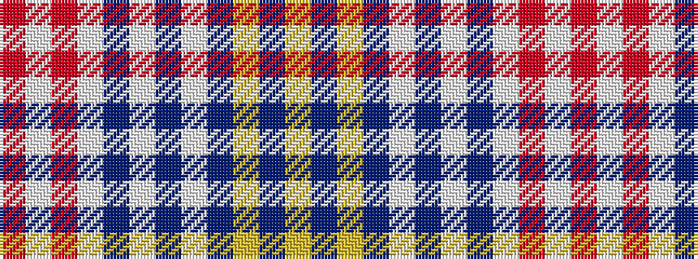

RWRWBWBWBYBY

It is a 12 stripe tartan.

<figure class="pat-woven">

<figcaption>idealised sample</figcaption>
</figure>

## Colour Sequence



## Tartans with this colour sequence

| Tartans |
|---------------|
| [Lysaght Dress](/variants/s12/r6w4r6w11db1w3db3w1db11lo6db4lo6~x4/)|
||
