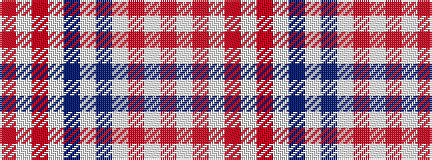

RWRWBWBWRWRWR

It is a 13 stripe tartan.

<figure class="pat-woven">

<figcaption>idealised sample</figcaption>
</figure>

## Colour Sequence



## Tartans with this colour sequence

| Tartans |
|---------------|
| [Red, White, Blue Watch (Dance)](/setts/s13/r12lb2r2lb2r2lb10db12lb3db12lb10r12lb2r2~x2/)|
||
