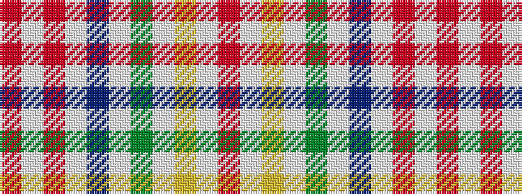

RWRWBWGWYWR

It is a 11 stripe tartan.

<figure class="pat-woven">

<figcaption>idealised sample</figcaption>
</figure>

## Colour Sequence



## Tartans with this colour sequence

| Tartans |
|---------------|
| [Bendigo](/variants/s11/r22w1lo7w1dg21w1db12w1ri1w1r8~x2/)|
||
