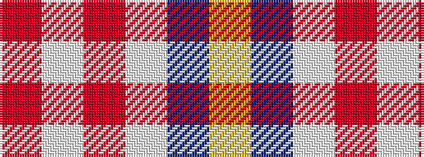

RWRWBY

It is a 6 stripe tartan.

<figure class="pat-woven">

<figcaption>idealised sample</figcaption>
</figure>

## Colour Sequence



## Tartans with this colour sequence

| Tartans |
|---------------|
| [Duminiak (Personal)](/variants/s6/o47w6r24w3dt5lo3~x2/)|
||
