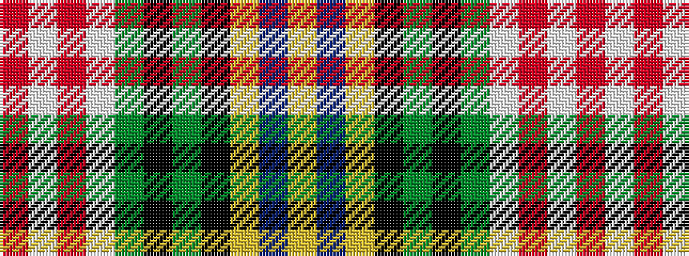

RWRWGKGKYBY

It is a 11 stripe tartan.

<figure class="pat-woven">

<figcaption>idealised sample</figcaption>
</figure>

## Colour Sequence



## Tartans with this colour sequence

| Tartans |
|---------------|
| [Beaudoux - Amis Picards (District)](/setts/s11/ly4db7ly4k26g3k1g3w9r2w4r2~x2/)|
||
