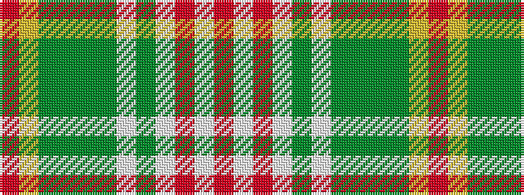

RWRWGWGGGGYR

It is a 12 stripe tartan.

<figure class="pat-woven">

<figcaption>idealised sample</figcaption>
</figure>

## Colour Sequence



## Tartans with this colour sequence

| Tartans |
|---------------|
| [Breacan](/variants/s12/o3w1o1w3gi1w1gi10g2gi1g10ly2r2~x2/)|
||
