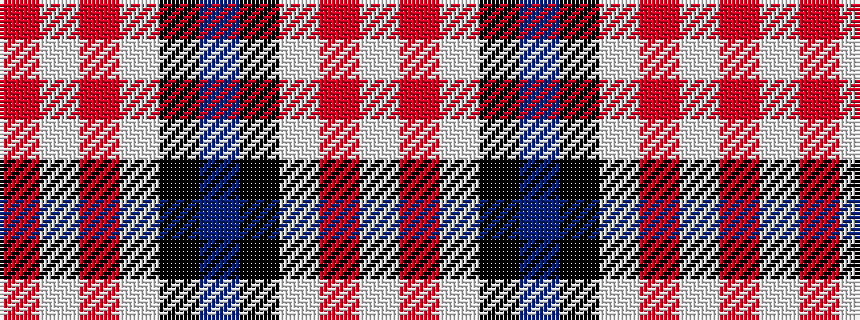

RWRWKBKWRW

It is a 10 stripe tartan.

<figure class="pat-woven">

<figcaption>idealised sample</figcaption>
</figure>

## Colour Sequence



## Tartans with this colour sequence

| Tartans |
|---------------|
| [Vemma (Corporate) XXXXXXXXX](/variants/s10/o24lb2o7lb3k2n4k2lb1o4lb1~x2/)|
||
