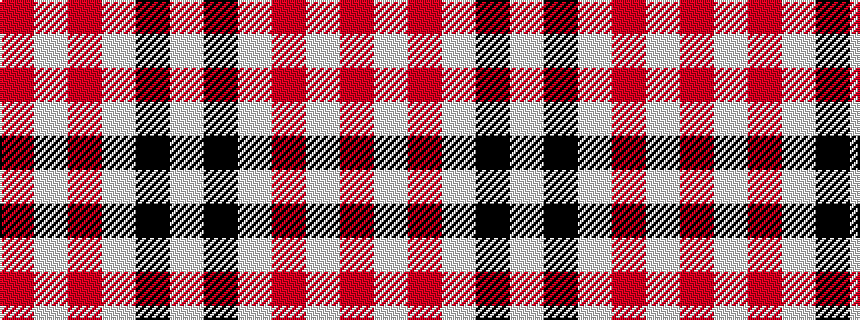

RWRWKW

It is a 6 stripe tartan.

<figure class="pat-woven">

<figcaption>idealised sample</figcaption>
</figure>

## Colour Sequence



## Tartans with this colour sequence

| Tartans |
|---------------|
| [Ailsa, Pink (Dance)](/variants/s6/r8w3r28w32k3w4~x2/)|
||
| [Gangs of New York Fashion Check Tartan](/variants/s6/w5k20w2r5w20r2~x2/)|
||
