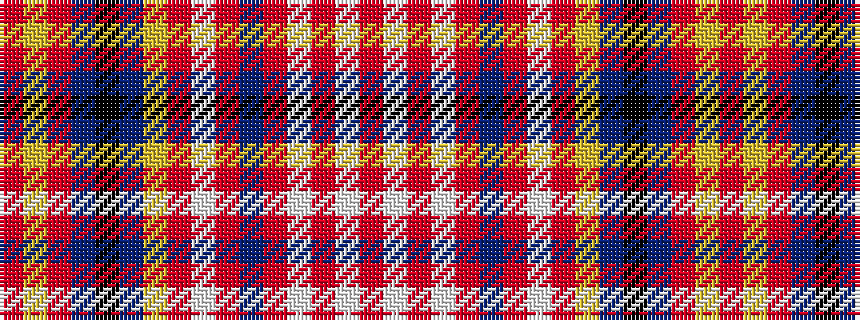

RWRWRBRWRYBKBRYR

It is a 16 stripe tartan.

<figure class="pat-woven">

<figcaption>idealised sample</figcaption>
</figure>

## Colour Sequence



## Tartans with this colour sequence

| Tartans |
|---------------|
| [Ruxton Hunting](/variants/s16/r17ly1r8db2k1db16ly3r1w1r15db4r2w3r1w1r16~x2/)|
||
| [Ruxton, hunting](/variants/s16/m17ly1m8db2k1db16ly3m1w1m15db4m2w3m1w1m16~x2/)|
||
