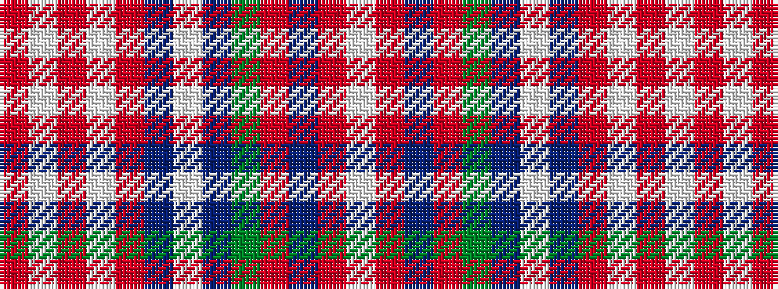

RWRWRBWBGRBRW

It is a 13 stripe tartan.

<figure class="pat-woven">

<figcaption>idealised sample</figcaption>
</figure>

## Colour Sequence



## Tartans with this colour sequence

| Tartans |
|---------------|
| [Ritchie](/setts/s13/r3lb2r3lb2r14db6lb3db6g16r6b6r6lb3~x2/)|
||
