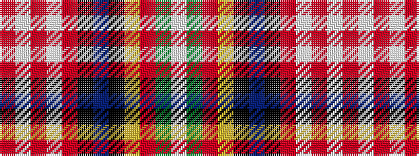

RWRWRKBKYRGW

It is a 12 stripe tartan.

<figure class="pat-woven">

<figcaption>idealised sample</figcaption>
</figure>

## Colour Sequence



## Tartans with this colour sequence

| Tartans |
|---------------|
| [Brittish Lions Corporate Tartan](/variants/s12/r70w2r1w4r1k2dt9k1ly2r1g9w3~x2/)|
||
| [Lions' Pride](/variants/s12/r46w2r2w3r2k3db7k2ly2r2g8w3~x2/)|
||
