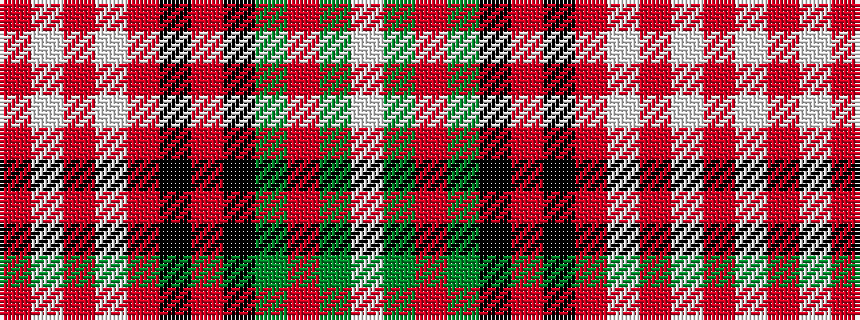

RWRWRKRKGRGW

It is a 12 stripe tartan.

<figure class="pat-woven">

<figcaption>idealised sample</figcaption>
</figure>

## Colour Sequence



## Tartans with this colour sequence

| Tartans |
|---------------|
| [Glen Nevis](/variants/s12/o22w2o2w2o4k5o5k5y5m2y13w2~x2/)|
||
