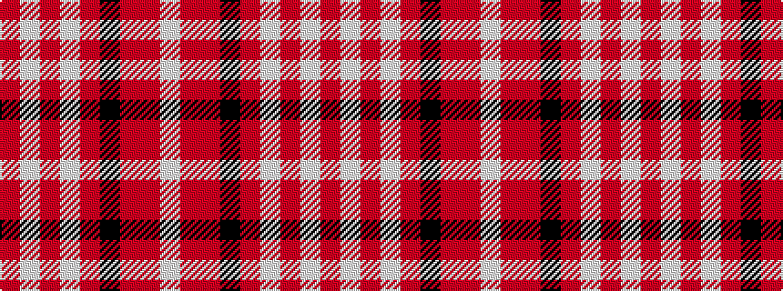

RWRWRKRRW

It is a 9 stripe tartan.

<figure class="pat-woven">

<figcaption>idealised sample</figcaption>
</figure>

## Colour Sequence



## Tartans with this colour sequence

| Tartans |
|---------------|
| [Ballater](/variants/s9/r12w2o3w2r3k5r2o18w2~x2/)|
||
