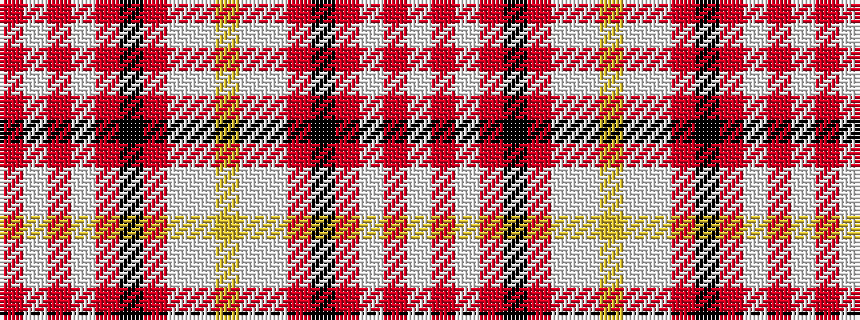

RWRWRKRWWYWWRKRWRW

It is a 18 stripe tartan.

<figure class="pat-woven">

<figcaption>idealised sample</figcaption>
</figure>

## Colour Sequence



## Tartans with this colour sequence

| Tartans |
|---------------|
| [Stirling & Bannockburn Dress](/variants/s18/w28r5lb3r5k21r5lb28w3ly5w3lb28r5k21r5lb3r5w28r5~x2/)|
||
