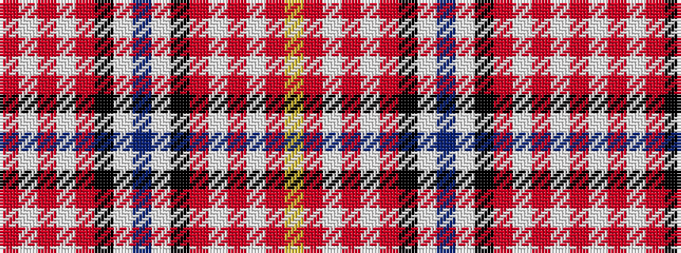

RWRWRKWBWKRWRWRY

It is a 16 stripe tartan.

<figure class="pat-woven">

<figcaption>idealised sample</figcaption>
</figure>

## Colour Sequence



## Tartans with this colour sequence

| Tartans |
|---------------|
| [Heart of Midlothian Football Club](/setts/s16/r24w2r2w2r4k11w12db3w12k11r4w2r2w2r24ly3~x2/)|
||
