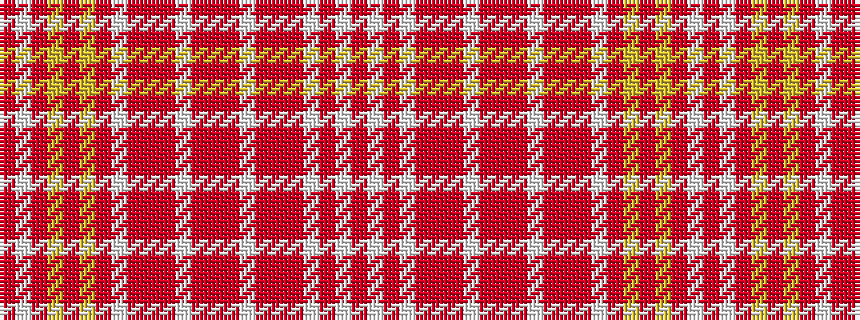

RWRWRRRWRRRWRRRWRYRYRWR

It is a 23 stripe tartan.

<figure class="pat-woven">

<figcaption>idealised sample</figcaption>
</figure>

## Colour Sequence



## Tartans with this colour sequence

| Tartans |
|---------------|
| [Glenorchy, Lord (Portrait)](/setts/s23/r50w1r12lo4r1lo4r12w1r4r1r4w1r6r1r6w1r4r1r4w1r12w1r50~x2/)|
||
