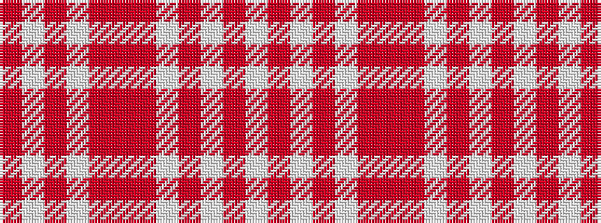

RWRWRRRWRWRW

It is a 12 stripe tartan.

<figure class="pat-woven">

<figcaption>idealised sample</figcaption>
</figure>

## Colour Sequence



## Tartans with this colour sequence

| Tartans |
|---------------|
| [Glasgow Fancy Tartan](/variants/s12/o16r3lb15r18w15o3lb3~x2/)|
||
