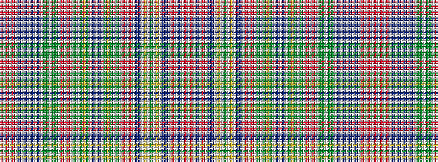

RWRWRWBWBWBWBWGGWGGWRWRWGWGYGWBWBWGYGWGWRWRWBBWYWGWYWBBWRWBWRW

It is a 62 stripe tartan.

<figure class="pat-woven">

<figcaption>idealised sample</figcaption>
</figure>

## Colour Sequence



## Tartans with this colour sequence

| Tartans |
|---------------|
| [Ritch](/setts/s62/r6w2r3w2r20w2t6w2dp10w2dp10w2t6w2dg10y4w2y4dg10w2r14w2r14w2dg3w2dg2ly2dg2w2t4w2t4w2dg2ly2dg2w2dg3w2r14w2r14w2dp10t2w2ly2w2dg2w2ly2w2t2dp10w2r20w2t6w2r14w1~x2/)|
||
