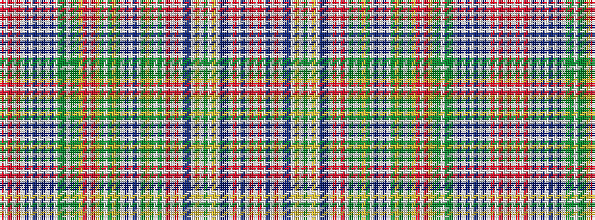

RWRWRWBWBWBWBWGGWGGYRWRYGWGYGWBWBWGYGWGWRWRWBBWYWGWYWBBWRWBWRW

It is a 62 stripe tartan.

<figure class="pat-woven">

<figcaption>idealised sample</figcaption>
</figure>

## Colour Sequence



## Tartans with this colour sequence

| Tartans |
|---------------|
| [Ritch](/variants/s62/r6w2r3w2r20w2t6w2p10w2p10w2t6w2g10gi4w2gi4g10lr2r14w2r14lr2g3w2g2ly2g2w2t4w2t4w2g2ly2g2w2g3w2r14w2r14w2p10t2w2ly4w2gi4w2ly4w2t2p10w2r20w2t6w2r14w1~x2/)|
||
| [Ritch Family Tartan](/variants/s62/r6w2r3w2r20w2t6w2dp10w2dp10w2t6w2gi10g4w2g4gi10lr2r14w2r14lr2gi3w2gi2ly2gi2w2t4w2t4w2gi2ly2gi2w2gi3w2r14w2r14w2dp10t2w2ly4w2g4w2ly4w2t2dp10w2r20w2t6w2r14w1~x2/)|
||
