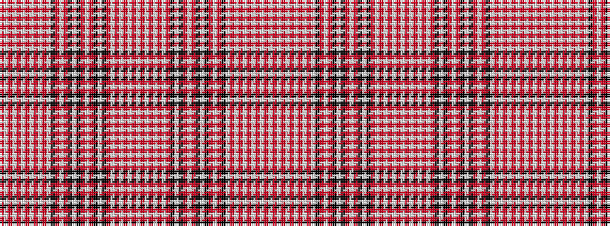

RWRWRWRWRWRWKRWRKWKRWRKWKRWRWRWRWRWRWRWRKWKRWRKWKRWRKWRWRWRWRWRW

It is a 64 stripe tartan.

<figure class="pat-woven">

<figcaption>idealised sample</figcaption>
</figure>

## Colour Sequence



## Tartans with this colour sequence

| Tartans |
|---------------|
| [Not Specified #4](/setts/s64/o35w2o2w2o2w2o2w2o2w2o14w38k4o4w4o4k4w4k4o4w4o4k4w16k36o19w2o4w4o3w4o2w13~x2/)|
||
