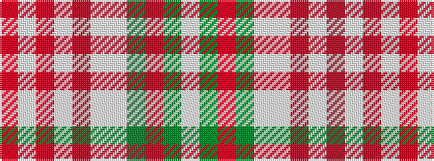

RWRWRWWGRGW

It is a 11 stripe tartan.

<figure class="pat-woven">

<figcaption>idealised sample</figcaption>
</figure>

## Colour Sequence



## Tartans with this colour sequence

| Tartans |
|---------------|
| [Ben Cleuch (Fashion)](/setts/s11/o68w3o3w8o3w3w24dy16r3dy20w3~x2/)|
||
