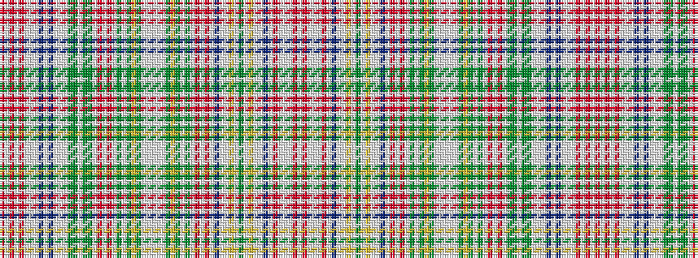

RWRWRWWWBWBWWWGGWGGWRWRWGWGYGWWWWWGYGWGWRWRWBWWYWGWYWWBWRWWWRW

It is a 62 stripe tartan.

<figure class="pat-woven">

<figcaption>idealised sample</figcaption>
</figure>

## Colour Sequence



## Tartans with this colour sequence

| Tartans |
|---------------|
| [Ritch (Fashion)](/variants/s62/r6w2r3w2r20w2lb6w2dp10w2dp10w2lb6w2dg10y4w2y4dg10w2r14w2r14w2dg3w2dg2ly2dg2w2lb4w2lb4w2dg2ly2dg2w2dg3w2r14w2r14w2dp10lb2w2ly4w2y4w2ly4w2lb2dp10w2r20w2lb6w2r14w1/)|
||
