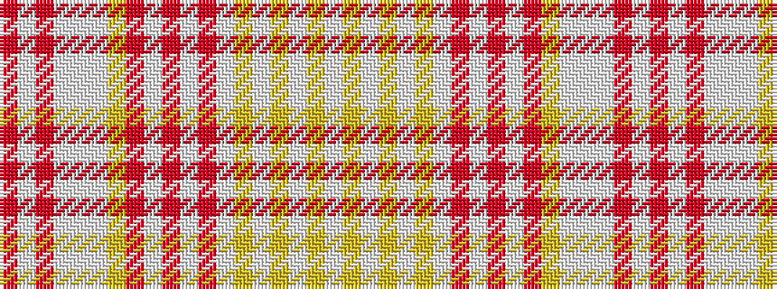

RWRWWWYRWRWRWYWYWYW

It is a 19 stripe tartan.

<figure class="pat-woven">

<figcaption>idealised sample</figcaption>
</figure>

## Colour Sequence



## Tartans with this colour sequence

| Tartans |
|---------------|
| [Beaufort (Name)](/variants/s19/o3w1o2w2w21w3lg2o8w2o2w2o2w8lg2w2lg2w2lg8w3~x2/)|
||
