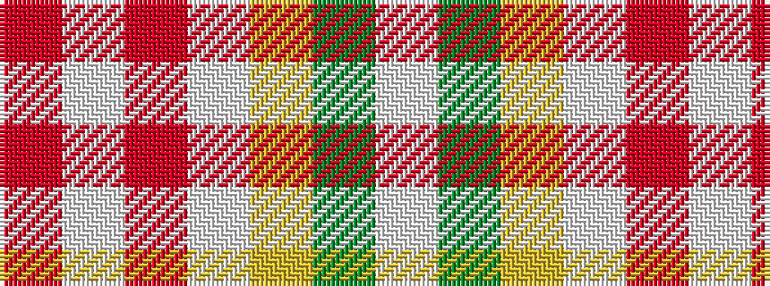

RWRWYGW

It is a 7 stripe tartan.

<figure class="pat-woven">

<figcaption>idealised sample</figcaption>
</figure>

## Colour Sequence



## Tartans with this colour sequence

| Tartans |
|---------------|
| [Gift of Life Michigan](/variants/s7/r2lt1r1lt11lg16g1w1~x2/)|
||
